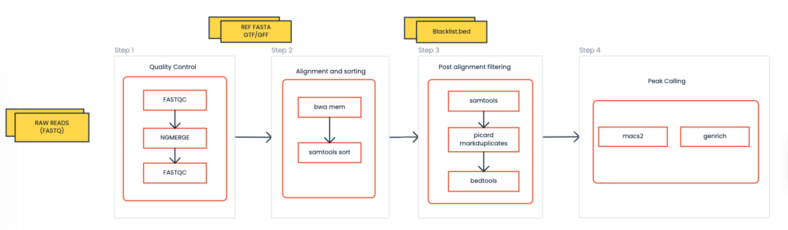

# ATAC-seq analysis:

This repo contains the scripts used for analysis of the assay for transposase-accessible chromatin with sequencing analysis (ATAC-seq),a method for determining chromatin accessibility across the genome. 

## PIPELINE FLOWCHART:



## STEPS:
- Pre-processing:
    - Quality Control using FASTQC tool
    - Trimming of adapters using NGmerge
- Alignment:
    - Mapping of the reads with the reference genome
- Post-alignment Filtering:
    - Mark Duplicates using Picard
    - Removal of PCR duplicates and low quality mapped reads
    - Removal of ENCODE blacklisted regions
- Peak Calling:
    - macs2
    - Genrich

## CONDA ENVIRONMENT: 
- Create a new conda environment and installing tools needed for atac-seq-script.sh script
```
conda create -f conda_envs/ATAC_seq.yml
conda activate ATAC_seq
```
## HOW TO RUN THE PIPELINE:
- INPUT PATHS:
    - FASTQ_DIR   =</path/of/the/directory/containing/fastq/files>
    - REF_DIR     =</path/of/the/directory/containing/reference/files>
    - RESULTS_DIR =</path/of/the/directory/to/store/results>
    - SPECIES     =</reference_genome/>

- Command:
```
    - bash atac-seq-script.sh <FASTQ_DIR> <REF_DIR> <RESULTS_DIR> <species>
```

- OUTPUT FOLDER:
    - align                 : mapped bam files
    - fastQC                : quality control reports for all the fastq files
    - filter                : post-alignment filtered files
    - peak_files            : narrow.peak files generated from macs2 and genrich
    - trim_ngmerge_fastq    : adapter trimmed fastq files


